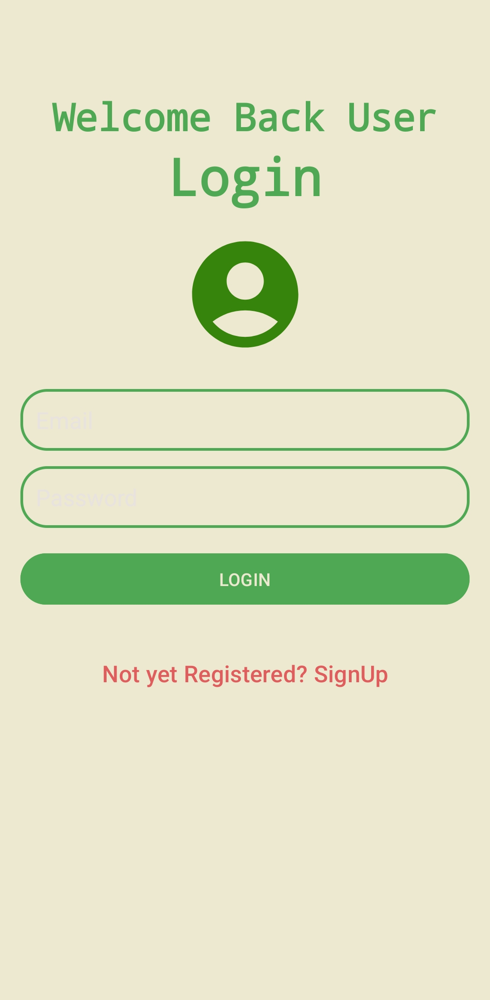

## Login Firebase Kotlin
### Exemplo de Login e SignUp por Autenticação Firebase

#### Como configurar o Firebase :

1. Crie uma conta no site do **Firebase**
2. No **Android Studio**:
   - Vá em **Tools → Firebase**
   - Selecione **Authentication**
   - Clique em **Authentication using a custom authentication system**
   - Clique em **Connect to Firebase**
3. No site do **Firebase**:
   - Clique em **Add Project**
   - Crie um novo projeto
4. De volta ao **Android Studio**:
   - Clique em **Add the Firebase Authentication SDK to your app**
5. No site do **Firebase**:
   - Acesse seu projeto
   - Vá em **Authentication → Get started**
   - Escolha **Email/Password**
   - Clique em **Enable Email/Password**
   - Clique em **Save**

### Observação
A senha deve conter **no mínimo 6 dígitos**.

  
  
  

